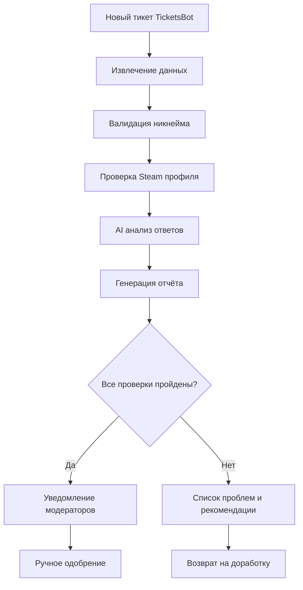

# 📋 Документация Discord Bot "VLG | Помощник"

## 📖 Оглавление

1. [Описание проекта](#описание-проекта)
2. [Архитектура](#архитектура)
3. [Установка и настройка](#установка-и-настройка)
4. [Конфигурация](#конфигурация)
5. [Функциональные возможности](#функциональные-возможности)
6. [API и интеграции](#api-и-интеграции)
7. [Структура кода](#структура-кода)
8. [Команды бота](#команды-бота)
9. [Система обработки заявок](#система-обработки-заявок)
10. [Логирование и мониторинг](#логирование-и-мониторинг)
11. [Безопасность](#безопасность)
12. [Troubleshooting](#troubleshooting)
13. [Планы развития](#планы-развития)

---

## 🎯 Описание проекта

**VLG | Помощник** — это специализированный Discord бот для управления игровым сообществом "Деревня VLG" (более 3800 участников, 170+ вайпов в игре Rust).

### Основные задачи:
- ✅ **Автоматизация процесса приёма новичков** в сообщество
- 🛡️ **Модерация и проверка заявок** на соответствие требованиям
- 🤖 **AI-ассистент** для помощи игрокам и модераторам
- 📊 **Интеграция с Steam API** для верификации профилей
- 🎮 **Управление ролями** и правами доступа

### Технический стек:
- **Python 3.10+** — основной язык разработки
- **discord.py 2.5+** — библиотека для работы с Discord API
- **aiohttp** — асинхронные HTTP-запросы
- **Steam Web API** — верификация игровых профилей
- **Groq/OpenRouter API** — AI-возможности для анализа заявок

---

## 🏗️ Архитектура

### Схема компонентов:

```
┌─────────────────┐    ┌──────────────────┐    ┌─────────────────┐
│   Discord API   │◄──►│   VLG Bot Core   │◄──►│   Steam API     │
└─────────────────┘    └──────────────────┘    └─────────────────┘
                               │
                               ▼
                    ┌──────────────────┐
                    │   AI Services    │
                    │ (Groq/OpenRouter)│
                    └──────────────────┘
```

### Основные модули:

```
bot.py              # Точка входа, инициализация бота
├── cogs/           # Команды и обработчики
│   ├── roles.py    # Управление ролями (/role, /info)
│   ├── ai.py       # AI-команды (/text)
│   └── ai_brain.py # AI промпты и логика
├── handlers/       # Бизнес-логика
│   ├── tickets.py  # Обработка заявок новичков
│   ├── novichok.py # Валидация данных новичков
│   ├── steam_api.py# Интеграция с Steam
│   └── novichok_actions.py # UI компоненты
├── utils/          # Утилиты
│   ├── logger.py   # Система логирования
│   ├── cache.py    # Кэширование
│   ├── retry.py    # Повторные попытки
│   ├── validators.py # Валидаторы
│   └── constants.py # Константы
└── config.py       # Конфигурация
```

---

## ⚙️ Установка и настройка

### Системные требования:
- Python 3.10 или выше
- Discord Application с Bot Token
- Steam Web API Key
- AI API Key (Groq или OpenRouter)

### Шаги установки:

1. **Клонирование проекта:**
```bash
git clone <repository-url>
cd vlg-discord-bot
```

2. **Установка зависимостей:**
```bash
pip install discord.py aiohttp
```

3. **Настройка переменных окружения:**
```bash
# В Replit Secrets или .env файле:
DISCORD_TOKEN=your_discord_bot_token
STEAM_API_KEY=your_steam_api_key
GROQ_API_KEY=your_groq_api_key
OPENROUTER_API_KEY=your_openrouter_api_key  # опционально
MODEL_ID=meta-llama/llama-4-scout-17b-16e-instruct
```

4. **Запуск бота:**
```bash
python bot.py
```

### Discord Application Setup:

1. Создайте приложение на [Discord Developer Portal](https://discord.com/developers/applications)
2. Создайте бота и скопируйте токен
3. Включите следующие Privileged Gateway Intents:
   - ✅ Message Content Intent
   - ✅ Server Members Intent
4. Пригласите бота на сервер с правами:
   - ✅ Read Messages/View Channels
   - ✅ Send Messages
   - ✅ Manage Roles
   - ✅ Use Slash Commands

---

## 🔧 Конфигурация

### Основные настройки (config.py):

```python
class Config:
    # Discord настройки
    DISCORD_TOKEN: str              # Токен бота
    APPLICATION_ID: int             # ID приложения Discord
    
    # API ключи
    STEAM_API_KEY: str             # Steam Web API
    GROQ_API_KEY: str              # Groq AI API
    OPENROUTER_API_KEY: str        # OpenRouter AI API (опционально)
    
    # ID каналов Discord
    NOTIFICATION_CHANNEL_ID: int   # Канал уведомлений
    LOG_CHANNEL_ID: int           # Канал логов
    MOD_CHANNEL_ID: int           # Канал модераторов
    
    # Безопасность
    MIN_ACCOUNT_AGE_DAYS: int = 90 # Минимальный возраст аккаунта
    FAKE_STEAM_DOMAINS: List[str]  # Список поддельных доменов Steam
    
    # Роли
    ALLOWED_ROLES: List[str]       # Разрешённые роли для команд
    MODERATOR_ROLES: List[str]     # Роли модераторов
    ADMIN_ROLES: List[str]         # Роли администраторов
```

### Кэширование и производительность:

```python
# Настройки кэша
DEFAULT_CACHE_TTL: int = 300      # 5 минут по умолчанию
STEAM_CACHE_TTL: int = 300        # Кэш Steam данных
AI_CACHE_TTL: int = 300           # Кэш AI ответов

# Rate limiting
STEAM_RATE_LIMIT_PER_SECOND: int = 1
STEAM_RATE_LIMIT_PER_5MIN: int = 100
```

---

## 🚀 Функциональные возможности

### 1. Slash-команды бота:

#### `/role` - Управление ролями
- **Описание:** Назначение ролей пользователям
- **Права доступа:** Модераторы и выше
- **Параметры:**
  - `пользователь` - целевой пользователь
  - `роль` - назначаемая роль
- **Пример:** `/role @Новичок Гражданин`

#### `/info` - Информация о пользователе
- **Описание:** Детальная информация об участнике сервера
- **Права доступа:** Все участники
- **Параметры:**
  - `пользователь` - целевой пользователь (опционально)
- **Показывает:**
  - Дата создания аккаунта
  - Дата присоединения к серверу
  - Текущие роли
  - Статус верификации

#### `/text` - AI-ассистент
- **Описание:** Общение с AI помощником
- **Права доступа:** Все участники
- **Параметры:**
  - `сообщение` - текст запроса к AI
- **Возможности:**
  - Ответы на вопросы об игре
  - Помощь с правилами сервера
  - Общие консультации

### 2. Автоматическая обработка заявок:

#### Процесс верификации новичков:
1. **Обнаружение нового тикета** от TicketsBot
2. **Извлечение данных** из заявки (Steam URL, часы в игре, и т.д.)
3. **Валидация никнейма** по формату "SteamNickname | Имя"
4. **Проверка Steam профиля:**
   - Валидность ссылки
   - Доступность профиля
   - Соответствие никнейма
   - Наличие игры Rust
   - Количество часов в игре
   - Открытость списка друзей
5. **AI-анализ ответов** на качество и адекватность
6. **Генерация отчёта** с рекомендациями

### 3. Steam интеграция:

#### Функции проверки профиля:
- ✅ **Обнаружение поддельных доменов Steam**
- ✅ **Проверка доступности профиля**
- ✅ **Извлечение никнейма из Steam**
- ✅ **Анализ библиотеки игр**
- ✅ **Подсчёт часов в Rust**
- ✅ **Проверка списка друзей**
- ✅ **Кэширование данных** для оптимизации

#### Безопасность Steam проверок:
```python
FAKE_STEAM_DOMAINS = [
    'xn--steamcommunity-vul.com',  # Punycode атака
    'steamcommunlty.com',          # Typosquatting
    'steamcommunitty.com',         # Double letters
    'steamcommunity.ru',           # Фейковый TLD
    'steamcommunity.org'           # Фейковый TLD
]
```

---

## 🔗 API и интеграции

### Steam Web API:

#### Используемые методы:
1. **GetPlayerSummaries** - основная информация о профиле
2. **GetOwnedGames** - библиотека игр пользователя
3. **GetFriendList** - список друзей (если открыт)

#### Пример запроса:
```python
async def fetch_steam_data(steam_id: str, force_refresh: bool = False) -> dict:
    """Получение данных Steam с кэшированием"""
    cache_key = f"steam_data_{steam_id}"
    
    if not force_refresh:
        cached_data = await cache.get(cache_key)
        if cached_data:
            return cached_data
    
    # Запрос к Steam API
    data = await make_steam_request(steam_id)
    
    # Кэширование результата
    await cache.set(cache_key, data, ttl=STEAM_CACHE_TTL)
    return data
```

### AI APIs (Groq/OpenRouter):

#### Groq AI Integration:
```python
async def ask_groq(prompt: str, max_tokens: int = 1000) -> str:
    """Запрос к Groq AI с обработкой ошибок"""
    headers = {
        "Authorization": f"Bearer {config.GROQ_API_KEY}",
        "Content-Type": "application/json"
    }
    
    payload = {
        "messages": [{"role": "user", "content": prompt}],
        "model": "llama3-70b-8192",
        "max_tokens": max_tokens
    }
    
    # Асинхронный запрос с retry логикой
    return await make_ai_request(payload, headers)
```

#### Применение AI в боте:
- 🧠 **Анализ качества ответов** в заявках
- 🔍 **Обнаружение неподходящих никнеймов**
- 💬 **Генерация ответов** на вопросы пользователей
- 📝 **Создание отчётов** по заявкам

---

## 📁 Структура кода

### Модульная архитектура:

#### 1. Основной файл (bot.py):
```python
# Инициализация бота
bot = commands.Bot(command_prefix="/", intents=intents)

# Загрузка расширений
async def load_extensions():
    extensions = ["cogs.roles", "cogs.ai", "handlers.tickets"]
    for ext in extensions:
        await bot.load_extension(ext)

# Обработка событий
@bot.event
async def on_ready():
    logger.info(f"🟢 Бот запущен как {bot.user}")
```

#### 2. Команды (cogs/):
```python
# cogs/roles.py - Управление ролями
class RolesCog(commands.Cog):
    @app_commands.command(name="role")
    async def assign_role(self, interaction: discord.Interaction, ...):
        # Логика назначения ролей
```

#### 3. Обработчики (handlers/):
```python
# handlers/tickets.py - Обработка заявок
async def process_ticket_message(message: discord.Message):
    # Извлечение данных заявки
    # Валидация информации
    # Генерация отчёта
```

#### 4. Утилиты (utils/):
```python
# utils/cache.py - Система кэширования
class Cache:
    async def get(self, key: str) -> Any
    async def set(self, key: str, value: Any, ttl: int) -> None
    async def delete(self, key: str) -> None
```

### Паттерны проектирования:

1. **Singleton** - для конфигурации (`config.py`)
2. **Strategy** - для разных AI провайдеров
3. **Observer** - для обработки Discord событий
4. **Factory** - для создания embed сообщений
5. **Cache-Aside** - для кэширования API данных

---

## 🎮 Команды бота

### Детальное описание команд:

#### 1. Команда `/role`:

**Синтаксис:**
```
/role пользователь:<@user> роль:<role_name>
```

**Ограничения доступа:**
- Только пользователи с ролями: Гражданин, Ополчение, Администратор
- Нельзя назначать роли выше своей

**Логика проверок:**
```python
async def assign_role_command(interaction, user, role):
    # 1. Проверка прав вызывающего
    if not has_permission(interaction.user, "manage_roles"):
        return await interaction.response.send_message("❌ Нет прав")
    
    # 2. Проверка целевой роли
    if role.name in EXCLUSIVE_ROLES:
        return await interaction.response.send_message("❌ Эксклюзивная роль")
    
    # 3. Назначение роли
    await user.add_roles(role)
    await log_role_assignment(user, role, interaction.user)
```

#### 2. Команда `/info`:

**Выводимая информация:**
- 👤 **Основные данные:** никнейм, ID, дата создания аккаунта
- 🏠 **На сервере:** дата присоединения, роли
- ⚡ **Статус:** онлайн/оффлайн, активность
- 🛡️ **Модерация:** предупреждения, статус верификации

**Пример вывода:**
```
📋 Информация о пользователе

👤 **Пользователь:** SteamNickname | Имя
🆔 **ID:** 123456789012345678
📅 **Аккаунт создан:** 15.03.2023 (возраст: 290 дней)
🏠 **На сервере с:** 20.08.2023
🎭 **Роли:** @Гражданин, @Новичок
⚡ **Статус:** 🟢 Онлайн
```

#### 3. Команда `/text`:

**AI Обработка:**
```python
async def ai_command(interaction, message):
    # Формирование контекста
    context = build_context(interaction.user, interaction.guild)
    
    # Запрос к AI
    response = await ask_groq(f"{context}\n\nВопрос: {message}")
    
    # Обработка ответа
    if len(response) > 2000:
        response = response[:1997] + "..."
    
    await interaction.response.send_message(response)
```

---

## 🎫 Система обработки заявок

### Workflow обработки заявки:



### Валидация данных заявки:

#### 1. Проверка никнейма:
```python
async def is_valid_nickname(nick: str) -> tuple[bool, str]:
    """
    Проверка формата: "SteamNickname | Имя"
    - Nickname: латиница/кириллица, цифры, _, -
    - Имя: только кириллица, с заглавной буквы
    """
    if "|" not in nick:
        return False, "Отсутствует символ '|'"
    
    nickname, name = nick.split("|", 1)
    nickname, name = nickname.strip(), name.strip()
    
    # Проверка имени (кириллица)
    if not re.match(r"^[А-ЯЁ][а-яё]+$", name):
        return False, "Имя должно быть кириллицей с заглавной буквы"
    
    # Проверка на мат и запрещённые слова
    if contains_profanity(nickname) or contains_profanity(name):
        return False, "Недопустимые слова в никнейме"
    
    return True, None
```

#### 2. Steam профиль валидация:
```python
async def check_steam_profile(steam_url: str, discord_nick: str) -> dict:
    """Комплексная проверка Steam профиля"""
    result = {
        "valid_url": False,
        "profile_accessible": False,
        "nickname_matches": False,
        "steam_nickname": "",
        "has_rust": False,
        "rust_hours": 0,
        "friends_list_open": False,
        "warnings": []
    }
    
    # 1. Проверка на фейковые домены
    for fake_domain in FAKE_STEAM_DOMAINS:
        if fake_domain in steam_url.lower():
            result["error"] = f"Поддельный домен: {fake_domain}"
            return result
    
    # 2. Извлечение Steam ID
    steam_id = extract_steam_id_from_url(steam_url)
    if not steam_id:
        result["error"] = "Некорректная Steam ссылка"
        return result
    
    # 3. Проверка через Steam API
    steam_data = await fetch_steam_data(steam_id)
    
    # 4. Анализ данных
    result.update(analyze_steam_data(steam_data, discord_nick))
    
    return result
```

#### 3. AI анализ качества ответов:
```python
async def analyze_application_quality(responses: list) -> dict:
    """AI оценка качества ответов в заявке"""
    
    prompt = f"""
    Проанализируй ответы в заявке на вступление в игровое сообщество:
    
    Ответы: {responses}
    
    Оцени:
    1. Серьёзность намерений (1-10)
    2. Качество ответов (осмысленные/формальные)
    3. Потенциальные проблемы
    4. Рекомендации
    
    Формат ответа: JSON
    """
    
    ai_response = await ask_groq(prompt)
    return parse_ai_analysis(ai_response)
```

### Автоматические действия:

#### Одобрение заявки:
1. ✅ Удаление роли "Прохожий"
2. ✅ Назначение роли "Новичок"
3. ✅ Уведомление в канал модераторов
4. ✅ Логирование действия

#### Отклонение заявки:
1. ❌ Сообщение с причинами отклонения
2. ❌ Рекомендации по исправлению
3. ❌ Возможность подать заявку повторно

---

## 📊 Логирование и мониторинг

### Система логирования:

#### Уровни логов:
- 🔴 **CRITICAL** - критические ошибки бота
- 🟠 **ERROR** - ошибки выполнения команд
- 🟡 **WARNING** - предупреждения и подозрительные действия
- 🔵 **INFO** - общая информация о работе
- ⚪ **DEBUG** - детальная отладочная информация

#### Конфигурация логгера:
```python
def setup_logger():
    """Настройка multi-target логирования"""
    
    # Форматтер для консоли
    console_formatter = logging.Formatter(
        '🤖 %(asctime)s | %(levelname)s | %(message)s',
        datefmt='%H:%M:%S'
    )
    
    # Форматтер для файла
    file_formatter = logging.Formatter(
        '%(asctime)s | %(levelname)s | %(name)s | %(message)s',
        datefmt='%Y-%m-%d %H:%M:%S'
    )
    
    # Handler для Discord канала
    discord_handler = DiscordHandler(bot, LOG_CHANNEL_ID)
    
    # Настройка корневого логгера
    logger = logging.getLogger()
    logger.addHandler(console_handler)
    logger.addHandler(file_handler)
    logger.addHandler(discord_handler)
    
    return logger
```

#### Discord Logger:
```python
class DiscordHandler(logging.Handler):
    """Отправка логов в Discord канал"""
    
    def __init__(self, bot, channel_id):
        super().__init__()
        self.bot = bot
        self.channel_id = channel_id
        self.message_queue = asyncio.Queue()
    
    def emit(self, record):
        """Добавление сообщения в очередь"""
        if record.levelno >= logging.WARNING:
            message = self.format(record)
            asyncio.create_task(self.send_to_discord(message))
    
    async def send_to_discord(self, message):
        """Асинхронная отправка в Discord"""
        try:
            channel = self.bot.get_channel(self.channel_id)
            if channel and len(message) <= 2000:
                await channel.send(f"```\n{message}\n```")
        except Exception:
            pass  # Избегаем циклических ошибок логирования
```

### Мониторинг производительности:

#### Метрики:
- ⏱️ **Время отклика команд** (latency)
- 🔄 **Количество обработанных заявок** в час/день
- 🌐 **API calls** к Steam/AI сервисам
- 💾 **Эффективность кэша** (hit ratio)
- 🚨 **Количество ошибок** по типам

#### Пример логирования команд:
```python
@bot.tree.error
async def command_error_handler(interaction, error):
    """Централизованная обработка ошибок команд"""
    
    command_name = interaction.command.name if interaction.command else 'unknown'
    user_info = f"{interaction.user} ({interaction.user.id})"
    
    if isinstance(error, discord.app_commands.CommandOnCooldown):
        logger.warning(f"⏰ COOLDOWN | /{command_name} | {user_info} | {error.retry_after:.2f}s")
    
    elif isinstance(error, discord.app_commands.MissingPermissions):
        logger.warning(f"🚫 NO_PERMS | /{command_name} | {user_info}")
    
    else:
        logger.error(f"❌ ERROR | /{command_name} | {user_info} | {error}")
```

---

## 🔒 Безопасность

### Защита от фейковых Steam профилей:

#### Методы обнаружения:
1. **Проверка доменов:** список известных фейковых доменов
2. **Punycode атаки:** обнаружение символов схожих с латиницей
3. **Typosquatting:** проверка опечаток в steamcommunity.com
4. **Редиректы:** проверка конечного URL назначения

```python
FAKE_STEAM_DOMAINS = [
    'xn--steamcommunity-vul.com',  # қ вместо k (punycode)
    'steamcommunlty.com',          # пропущена i
    'steamcommunitty.com',         # двойная t
    'steamcommunity.ru',           # .ru вместо .com
    'steamcommunity.org',          # .org вместо .com
    'steam-community.com',         # дефис
    'steamcommuniity.com',         # двойная i
    'steancommunity.com',          # n вместо m
]

def is_fake_steam_domain(url: str) -> bool:
    """Проверка URL на фейковые домены"""
    url_lower = url.lower()
    
    for fake_domain in FAKE_STEAM_DOMAINS:
        if fake_domain in url_lower:
            logger.warning(f"🚨 Обнаружен фейковый домен: {fake_domain}")
            return True
    
    return False
```

### Валидация входных данных:

#### Санитизация пользовательского ввода:
```python
def sanitize_input(text: str, max_length: int = 500) -> str:
    """Очистка пользовательского ввода"""
    if not text:
        return ""
    
    # Обрезка по длине
    text = text[:max_length]
    
    # Удаление опасных символов
    text = re.sub(r'[<>"\']', '', text)
    
    # Нормализация Unicode
    text = unicodedata.normalize('NFKC', text)
    
    return text.strip()
```

#### Защита от SQL инъекций и XSS:
- ✅ Параметризованные запросы (если используется БД)
- ✅ Экранирование HTML в embed сообщениях
- ✅ Валидация всех входных параметров
- ✅ Ограничение длины сообщений

### Rate Limiting:

#### Ограничения API запросов:
```python
class RateLimiter:
    def __init__(self, max_requests: int, time_window: int):
        self.max_requests = max_requests
        self.time_window = time_window
        self.requests = {}
    
    async def is_allowed(self, user_id: int) -> bool:
        """Проверка лимита запросов"""
        now = time.time()
        
        # Очистка старых записей
        self.cleanup_old_requests(now)
        
        # Проверка лимита для пользователя
        user_requests = self.requests.get(user_id, [])
        
        if len(user_requests) >= self.max_requests:
            return False
        
        # Добавление нового запроса
        user_requests.append(now)
        self.requests[user_id] = user_requests
        
        return True
```

### Управление правами доступа:

#### Иерархия ролей:
```python
ROLE_HIERARCHY = {
    "Прохожий": 0,
    "Новичок": 1,
    "Гость": 2,
    "Житель": 3,
    "Гражданин": 4,
    "Ополчение": 5,
    "Зам.Коменданта[О]": 6,
    "Офицер": 7,
    "Администратор": 8
}

def can_assign_role(assigner_roles: list, target_role: str) -> bool:
    """Проверка прав на назначение роли"""
    max_assigner_level = max(
        ROLE_HIERARCHY.get(role.name, 0) 
        for role in assigner_roles
    )
    
    target_level = ROLE_HIERARCHY.get(target_role, 0)
    
    return max_assigner_level > target_level
```

---

## 🔧 Troubleshooting

### Частые проблемы и решения:

#### 1. Бот не отвечает на команды:

**Симптомы:**
- Slash команды не появляются в Discord
- Команды выдают ошибку "Unknown interaction"

**Решения:**
```bash
# Проверить синхронизацию команд
await bot.tree.sync()

# Проверить права бота на сервере
# - Use Slash Commands
# - Send Messages
# - View Channels
```

#### 2. Steam API не работает:

**Симптомы:**
- Ошибки "HTTP 429 Too Many Requests"
- Пустые ответы от Steam

**Решения:**
```python
# Проверить ключ API
if not config.STEAM_API_KEY:
    logger.error("Steam API ключ не установлен")

# Добавить retry логику
@retry(max_attempts=3, delay=1.0)
async def fetch_steam_data(steam_id):
    # ... код запроса
```

#### 3. AI API ошибки:

**Симптомы:**
- Таймауты запросов
- Ошибки аутентификации

**Решения:**
```python
# Fallback между провайдерами
async def ask_ai(prompt: str) -> str:
    try:
        return await ask_groq(prompt)
    except Exception as e:
        logger.warning(f"Groq недоступен: {e}")
        try:
            return await ask_openrouter(prompt)
        except Exception as e2:
            logger.error(f"Все AI провайдеры недоступны: {e2}")
            return "Извините, AI временно недоступен."
```

#### 4. Проблемы с правами доступа:

**Симптомы:**
- "Missing Permissions" ошибки
- Бот не может назначать роли

**Решения:**
1. Убедиться что роль бота выше назначаемых ролей
2. Проверить права "Manage Roles" у бота
3. Проверить иерархию ролей на сервере

#### 5. Проблемы с логированием:

**Симптомы:**
- Логи не сохраняются в файл
- Discord handler не работает

**Решения:**
```python
# Создание директории логов
import os
log_dir = 'logs'
if not os.path.exists(log_dir):
    os.makedirs(log_dir)

# Проверка прав канала для логов
channel = bot.get_channel(LOG_CHANNEL_ID)
if not channel:
    logger.error(f"Канал логов {LOG_CHANNEL_ID} не найден")
```

### Debug режим:

```python
# Включение детального логирования
logging.getLogger().setLevel(logging.DEBUG)

# Дополнительные debug команды
@bot.command(hidden=True)
@commands.is_owner()
async def debug_info(ctx):
    """Отладочная информация о боте"""
    info = {
        "Guilds": len(bot.guilds),
        "Users": len(bot.users),
        "Latency": f"{bot.latency*1000:.2f}ms",
        "Cogs": list(bot.cogs.keys()),
        "Commands": len(bot.tree.get_commands())
    }
    
    embed = discord.Embed(title="🔧 Debug Info", color=0x00ff00)
    for key, value in info.items():
        embed.add_field(name=key, value=value, inline=True)
    
    await ctx.send(embed=embed)
```

---

## 🚀 Планы развития

### Краткосрочные улучшения (1-2 месяца):

#### 1. Система уведомлений:
- 📧 **Email уведомления** для администраторов
- 📱 **Webhook интеграции** с внешними системами
- ⏰ **Автоматические напоминания** о необработанных заявках

#### 2. Расширенная аналитика:
- 📊 **Dashboard** со статистикой бота
- 📈 **Метрики производительности** в реальном времени
- 📋 **Отчёты по активности** пользователей

#### 3. Улучшение AI:
- 🧠 **Более точные промпты** для анализа заявок
- 🎯 **Персонализированные ответы** на основе истории
- 🔍 **Автоматическое обнаружение подозрительных заявок**

### Среднесрочные цели (3-6 месяцев):

#### 1. База данных:
- 💾 **PostgreSQL интеграция** для хранения данных
- 📚 **История заявок** и решений модераторов
- 🔍 **Поиск по пользователям** и статистике

#### 2. Web интерфейс:
- 🌐 **Административная панель** для управления ботом
- 📋 **Обзор заявок** через веб-интерфейс
- ⚙️ **Настройка конфигурации** без редактирования кода

#### 3. Расширенная интеграция:
- 🎮 **Battlemetrics API** для отслеживания игровой активности
- 💬 **TeamSpeak/Discord Voice** статистика
- 🛡️ **Автоматическая модерация** чата

### Долгосрочное развитие (6+ месяцев):

#### 1. Машинное обучение:
- 🤖 **Собственная ML модель** для анализа заявок
- 📊 **Предиктивная аналитика** поведения пользователей
- 🎯 **Автоматическая классификация** проблемных заявок

#### 2. Микросервисная архитектура:
- 🏗️ **Разделение на независимые сервисы**
- 🔄 **API Gateway** для внешних интеграций
- 📡 **Event-driven архитектура** для scalability

#### 3. Мультисерверная поддержка:
- 🌐 **Поддержка нескольких Discord серверов**
- 🔗 **Кросс-серверная синхронизация**
- 👥 **Централизованное управление пользователями**

---

## 📋 Заключение

### Текущее состояние проекта:

✅ **Готовые функции:**
- Автоматизированная обработка заявок новичков
- Steam интеграция с валидацией профилей
- AI-ассистент для помощи пользователям
- Система управления ролями
- Комплексное логирование и мониторинг

🔄 **В разработке:**
- Улучшение AI промптов
- Оптимизация производительности
- Расширение системы безопасности

🎯 **Планируется:**
- Web интерфейс для администрирования
- База данных для хранения истории
- Расширенная аналитика и отчётность

### Технические характеристики:

- **Язык:** Python 3.10+
- **Фреймворк:** discord.py 2.5+
- **Архитектура:** Модульная, асинхронная
- **API интеграции:** Steam Web API, Groq AI, OpenRouter
- **Производительность:** До 100 заявок в час
- **Надёжность:** Автоматический retry, graceful degradation

### Поддержка и развитие:

📧 **Контакты для поддержки:**
- Discord: VLG сообщество
- Техническая поддержка: через тикет систему

🔄 **Обновления:**
- Регулярные обновления безопасности
- Новые функции по запросам сообщества
- Оптимизация производительности

---

*Документация актуальна на: {{ current_date }}*  
*Версия бота: v1.0.0*  
*Автор: VLG Development Team*
