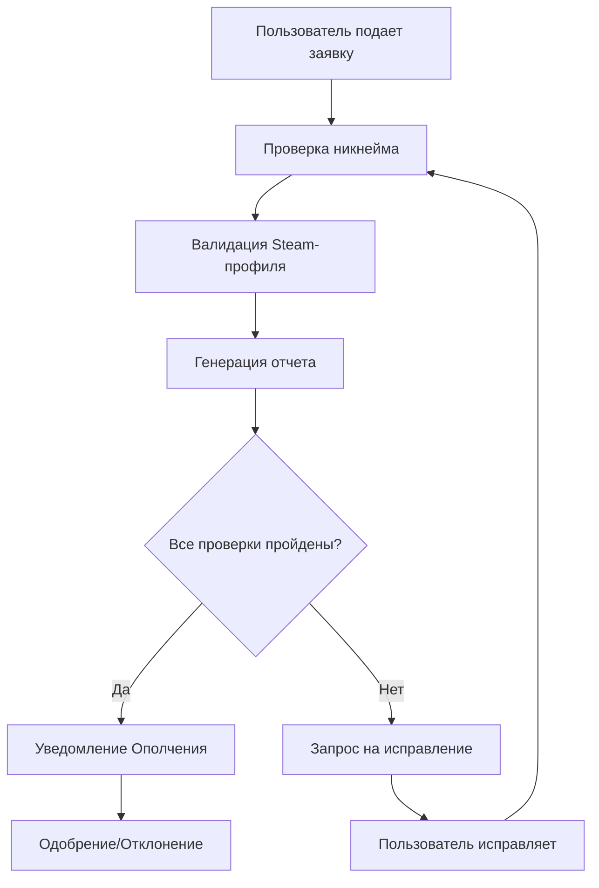

# 📋 Техническая документация Discord-бота "VLG-Helper"

## 📝 Общее описание

### Назначение бота
Discord-бот "VLG | Помощник" — это многофункциональный AI-ассистент, созданный для автоматизации процессов управления сообществом игроков Rust "Деревня VLG" (более 3800 участников, 170+ вайпов).

### Описание сообщества
"Деревня VLG" — это мирное сообщество игроков Rust, где все участники живут рядом как соседи, соблюдают единые правила и помогают друг другу развиваться. Сообщество имеет четкую иерархию ролей и систему управления.

### Ключевые функции
- **Автоматизированная обработка заявок** на вступление в сообщество
- **AI-помощник** для ответов на вопросы новичков
- **Валидация Steam-профилей** с проверкой наличия Rust и активности
- **Система управления ролями** с автоматическими повышениями
- **Модерационные инструменты** для Комендатуры
- **Система тикетов** для обработки заявок

---

## 🏗️ Архитектура и структура проекта

### Структура папок и файлов

```
VLG-Helper/
├── bot.py                  # Главный файл запуска бота
├── config.py              # Централизованная конфигурация
├── web_server.py          # Веб-сервер для статуса (keep-alive)
├── cogs/                  # Модули команд и функций
│   ├── ai.py              # AI-респондер для ответов
│   ├── ai_brain.py        # Система промптов для AI
│   ├── roles.py           # Управление ролями
│   ├── entry_form.py      # Форма подачи заявок
│   ├── application_system.py # Система обработки заявок
│   └── admin_panel.py     # Административная панель
├── handlers/              # Обработчики событий
│   ├── steam_api.py       # Клиент Steam Web API
│   ├── tickets.py         # Обработка тикетов/заявок
│   ├── novichok.py        # Валидация профилей новичков
│   ├── novichok_actions.py # Действия с новичками
│   └── auto_response.py   # Автоответы
├── utils/                 # Утилиты и вспомогательные функции
│   ├── cache.py           # Система кэширования
│   ├── db.py              # Работа с базой данных
│   ├── logger.py          # Централизованное логирование
│   ├── rate_limiter.py    # Ограничение скорости запросов
│   ├── retry.py           # Повторные попытки запросов
│   └── validators.py      # Валидаторы данных
├── docs/                  # Документация
└── static/                # Статические файлы для веб-сервера
```

### Основные модули

| Модуль | Назначение |
|--------|-----------|
| `bot.py` | Инициализация и запуск бота |
| `config.py` | Конфигурация каналов, ролей, API ключей |
| `cogs/ai.py` | AI-респондер с защитой от jailbreak |
| `handlers/steam_api.py` | Интеграция с Steam Web API |
| `handlers/tickets.py` | Обработка заявок и тикетов |
| `utils/cache.py` | Кэширование для оптимизации |

### Используемые библиотеки

**Основные зависимости:**
```toml
discord-py = "^2.4.0"        # Discord API
aiohttp = "^3.10.11"         # Асинхронные HTTP-запросы
asyncpg = "^0.30.0"          # PostgreSQL клиент
flask = "^3.1.0"             # Веб-сервер keep-alive
```

**AI интеграции:**
- Groq API (основной AI провайдер)
- OpenRouter API (резервный)
- Модель: `meta-llama/llama-4-scout-17b-16e-instruct`

**Внешние API:**
- Steam Web API для проверки профилей
- Supabase PostgreSQL для хранения данных

---

## ⚙️ Основной функционал

### Slash-команды

| Команда | Права доступа | Описание |
|---------|---------------|----------|
| `/admin_panel` | Администраторы Discord | Открыть панель управления ботом с настройками |
| `/count_role` | Все пользователи | Подсчитать количество участников с определённой ролью |
| `/create_application_panel` | Житель, Гражданин | Создать панель для подачи заявок с автообновлением |
| `/help` | Все пользователи | Показать список основных команд бота |
| `/help_commands` | Все пользователи | Показать полный список всех доступных команд |
| `/info` | Комендатура (модераторы) | Отправить стандартное сообщение о требованиях заявки |
| `/reload_settings` | Администраторы Discord | Перезагрузить настройки бота из файла конфигурации |
| `/role` | Комендатура (модераторы) | Назначение ролей пользователям (Новичок, Прохожий, военные) |
| `/sync_commands` | Администраторы Discord | Пересинхронизировать slash-команды в Discord |
| `/text` | Комендатура (модераторы) | Отправить текстовое сообщение или Embed в указанный канал |
| `/ticket` | Все пользователи | Создать заявку на вступление через модальную форму |
| `/update_application_panel` | Житель, Гражданин | Обновить существующую панель заявок с актуальными данными |

**Примеры использования:**
- `/role @пользователь @роль_Новичок` — выдать роль Новичок
- `/count_role @роль_Житель` — посчитать количество Жителей
- `/text #канал "Привет всем!" True` — отправить Embed сообщение
- `/create_application_panel #заявки` — создать панель заявок в канале

### Система ролей

**Игровые роли (иерархия):**
```
Прохожий → Новичок → Гость → Житель → Гражданин → Староста
```

**Управление ролями ботом "VLG | Помощник":**
- ✅ **Может управлять:** только переключением "Прохожий" ↔ "Новичок" через команду `/role`
- ❌ **Не управляет:** всеми остальными ролями (Гость, Житель, Гражданин и выше)
- ❌ **Не управляет:** цветными ролями активности (⚫🔴🟡🟢) — это функция Statbot
- ❌ **Не управляет:** модерационными и военными ролями — только ручное назначение администрацией

> **Важно:** Повышение по иерархии (кроме Прохожий→Новичок) происходит исключительно вручную администрацией сервера или через другие специализированные боты.

**Модерация (Общая роль у каждого из них Комендатура):**
```
Стажёр → Дежурный → Аналитик → Инспектор → Зам.Коменданта[М] → Комендант
```

**Военные (Общая роль у каждого из них Ополчение):**
```
Солдат → Боец → Сержант → Офицер → Зам.Коменданта[О]
```

**Автоматические роли активности:**
- ⚫ (1-5 часов за 30 дней) — очень низкая активность
- 🔴 (5-25 часов за 14 дней) — низкая активность  
- 🟡 (25-35 часов за 14 дней) — средняя активность
- 🟢 (35+ часов за 14 дней) — высокая активность

> **Важно:** Данные роли выдаются исключительно внешним ботом **Statbot**. Бот "VLG | Помощник" не участвует в их выдаче или управлении, а только читает их наличие у пользователей при необходимости.

### Система заявок

**Процесс подачи заявки:**
1. Пользователь нажимает кнопку "Подать заявку"
2. Заполняет модальную форму с данными
3. Создается тикет-канал с префиксом `new_`
4. Бот проверяет Steam-профиль и никнейм
5. Генерируется отчет для модерации
6. Ополчение принимает решение

**Валидация заявки:**
- ✅ Ник в формате "SteamNickname | Имя"
- ✅ Корректная Steam-ссылка
- ✅ Открытый Steam-профиль
- ✅ Наличие Rust в библиотеке
- ✅ Открытый список друзей
- ✅ Возраст аккаунта 90+ дней

### Steam API интеграция

**Проверяемые данные:**
```python
{
    "profile_private": bool,           # Приватность профиля
    "has_rust": bool,                 # Наличие Rust
    "rust_playtime_minutes": int,     # Время в игре
    "account_created": str,           # Дата создания
    "friends_list_open": bool,        # Открытость списка друзей
    "total_games": int,               # Количество игр
    "steam_api_error": bool           # Ошибка API
}
```

**Защита от поддельных ссылок:**
- Проверка на фейковые домены
- Валидация формата steamID64
- Конвертация vanity URL в steamID64

### AI-помощник

**Функции AI:**
- Ответы на вопросы о правилах Деревни
- Помощь с заявками
- Объяснение системы ролей
- Информация о серверах и вайпах

**Защита от взлома:**
- Блокировка jailbreak команд
- Фильтрация запросов DAN/ChatGPT
- Контроль промптов
- Ограничение функций

---

## 👥 Взаимодействие с пользователями

### Сценарий обработки заявки



### Примеры интерфейса

**Заявка на вступление:**
```
📋 Заявка на вступление в Деревню VLG

👤 Пользователь: SteamNickname | Имя
🔗 Steam: https://steamcommunity.com/profiles/76561198...
📅 Дата регистрации: 2024-01-15
🎮 Rust: 120 часов
👥 Пригласил: Friend | Друг

✅ Все проверки пройдены
⏳ Ожидает решения Ополчения
```

**AI-ответ на вопрос:**
```
Пользователь: Как получить роль Гражданин?
Помощник: Для получения роли Гражданин нужно:
- Отыграть 5 вайпов подряд с ролью Житель
- Иметь активность 🟢 (35+ часов голосовой активности)
- Пройти тест на знание правил Деревни
- Подать заявку через канал 🔼повышение-роли
```

---

## 🔧 Администрирование и поддержка

### Запуск и деплой на Replit

**Требуемые переменные окружения:**
```bash
DISCORD_TOKEN=your_discord_token
STEAM_API_KEY=your_steam_api_key
GROQ_API_KEY=your_groq_api_key
DB_HOST=your_db_host
DB_USER=your_db_user
DB_PASSWORD=your_db_password
DB_NAME=your_db_name
```

**Запуск:**
1. Клонировать репозиторий в Replit
2. Настроить переменные окружения
3. Запустить команду `python bot.py`
4. Бот автоматически синхронизирует slash-команды

### Добавление новой команды

**Создание команды:**
```python
@app_commands.command(name="новая_команда")
async def new_command(self, interaction: discord.Interaction):
    """Описание команды"""
    await interaction.response.send_message("Ответ команды")
```

**Добавление в cog:**
```python
async def setup(bot):
    await bot.add_cog(NewCog(bot))
```

### Система логирования

**Уровни логирования:**
- `INFO` — обычная работа
- `WARNING` — предупреждения
- `ERROR` — ошибки
- `DEBUG` — отладочная информация

**Каналы логирования:**
- Технические логи → канал 1290429444955181137
- Модерация → личные сообщения модераторам
- Заявки → тикет-каналы

### Безопасность

**Ограничения доступа:**
- Команды модерации доступны только ролям Комендатуры
- AI-запросы фильтруются от jailbreak
- Steam API защищен rate limiting
- Данные кэшируются с TTL 5 минут

---

## 🔬 Технические детали

### Ключевые алгоритмы

**Проверка сходства никнеймов:**
```python
def _calculate_nickname_similarity(nick1: str, nick2: str) -> float:
    """Алгоритм Левенштейна для сравнения никнеймов"""
    # Нормализация и сравнение
    # Возвращает коэффициент сходства 0.0-1.0
```

**Rate limiting для Steam API:**
```python
async def _enforce_rate_limit(self):
    """Обеспечивает лимиты: 1 запрос/сек, 100 запросов/5мин"""
    # Контроль временных интервалов
    # Автоматические задержки
```

### Интеграции с внешними сервисами

**Steam Web API:**
- `GetPlayerSummaries` — данные профиля
- `GetOwnedGames` — библиотека игр
- `GetFriendList` — список друзей
- `ResolveVanityURL` — конвертация vanity URL

**AI провайдеры:**
- Groq (основной) — быстрые ответы
- OpenRouter (резервный) — при недоступности Groq

**Внешние боты и сервисы:**
- **Statbot** — полностью управляет цветными ролями активности (⚫🔴🟡🟢)
  - Отслеживает голосовую активность участников
  - Автоматически выдает/убирает роли на основе статистики
  - "VLG | Помощник" только читает наличие этих ролей, не управляет ими

### Кэширование и оптимизация

**Система кэша:**
```python
# Кэширование на 5 минут
await set_cache(key, data, ttl=300)
cached_data = await get_cached(key)
```

**Оптимизации:**
- Кэширование Steam-данных
- Кэширование AI-ответов
- Batch-запросы к API
- Асинхронная обработка

---

## 🆘 FAQ и советы по эксплуатации

### Частые вопросы

**Q: Бот не отвечает на команды**
A: Проверьте права доступа и перезапустите бота

**Q: Steam API возвращает ошибки**
A: Проверьте STEAM_API_KEY и лимиты запросов

**Q: AI дает неправильные ответы**
A: Обновите промпты в `ai_brain.py`

**Q: Заявки не обрабатываются**
A: Проверьте конфигурацию каналов в `config.py`

### Возможные проблемы

**Проблема:** Превышение лимитов Steam API
**Решение:** Увеличить задержки в `steam_api.py`

**Проблема:** Переполнение кэша
**Решение:** Уменьшить TTL или очистить кэш

**Проблема:** Блокировка AI-запросов
**Решение:** Проверить промпты на jailbreak-паттерны

### Рекомендации по эксплуатации

1. **Мониторинг:** Следите за логами в Discord
2. **Обновления:** Регулярно обновляйте промпты AI
3. **Бэкапы:** Сохраняйте важные данные
4. **Тестирование:** Проверяйте новые функции на тестовом сервере

---

## 📊 Планы развития

### Краткосрочные планы
- Улучшение AI-ответов
- Оптимизация Steam API
- Расширение системы логирования

### Долгосрочные планы
- **Черный список нарушителей** — база данных забаненных Steam-профилей
- **Расширенная аналитика** — статистика активности игроков
- **Интеграция с игровыми серверами** — прямая связь с Rust-серверами

### Техническая задолженность
- Рефакторинг обработчиков тикетов
- Улучшение error handling
- Добавление unit-тестов

---

*Документация создана для Discord-бота "VLG | Помощник" версии 2.0*
*Последнее обновление: 07.01.2025*
